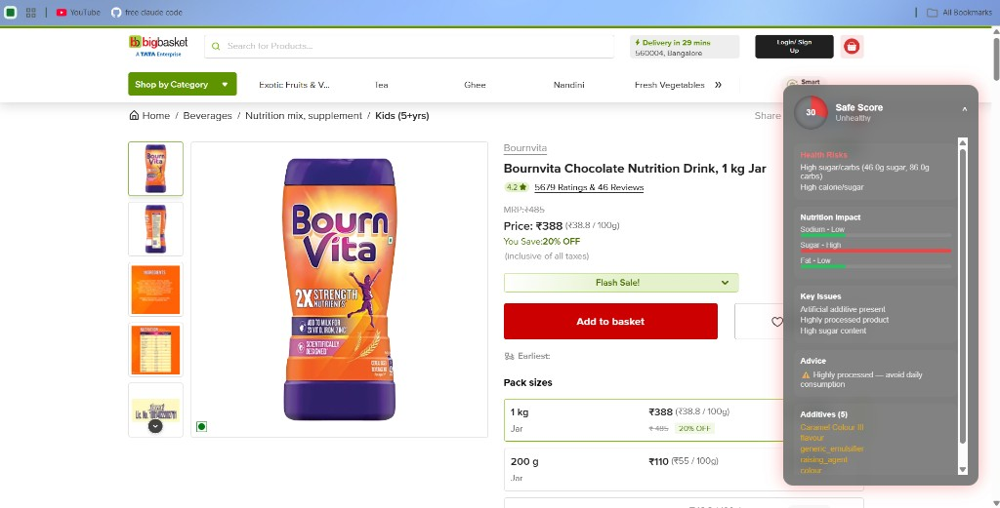
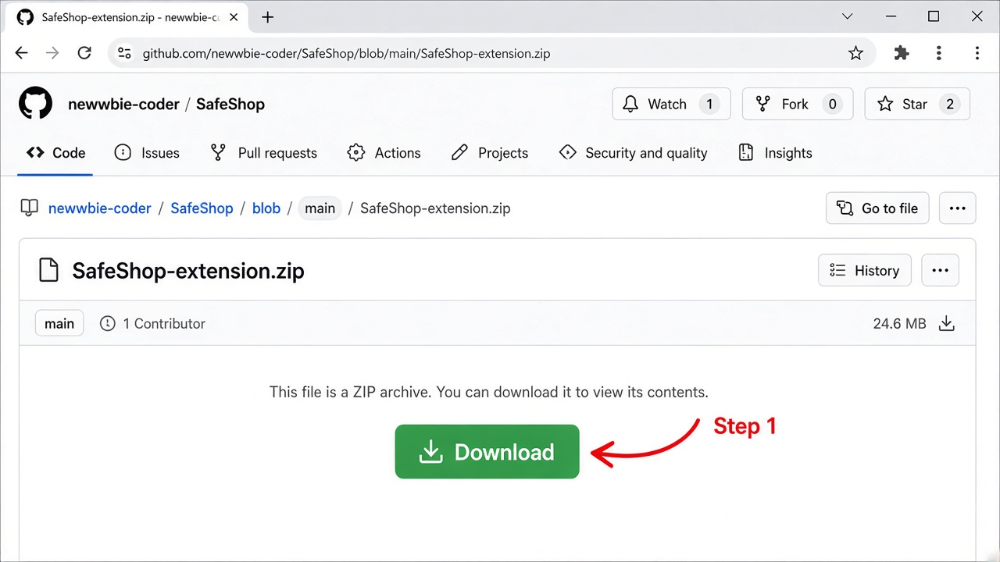
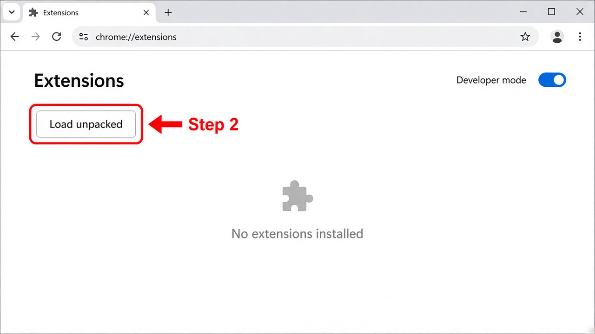
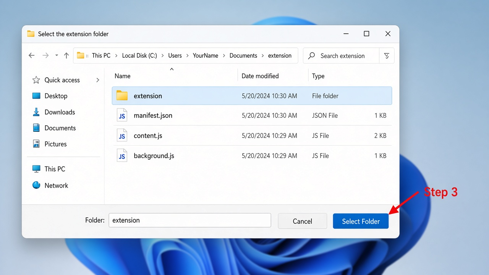
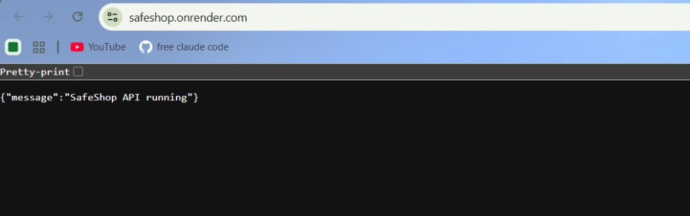

# SafeShop

**Explainable health scores for packaged food — on the BigBasket product page.**

A Chrome extension plus a hosted API. SafeShop reads ingredients and nutrition (from the page, or from a 10k-product catalog when the site hides the label), then returns a **score, verdict, and reasons**. It does not scrape other grocery apps, and it does not hide the scoring behind a model.

<p align="center">
  
</p>

<p align="center"><sub>Live demo: Bournvita on BigBasket — score <b>30 / Unhealthy</b>, with sugar, processing, and additive reasons.</sub></p>

[Download the extension zip](https://github.com/newwbie-coder/SafeShop/raw/cursor/android-safeshop-companion-7b69/SafeShop-extension.zip)
·
[API](https://safeshop.onrender.com/)
·
[Health check](https://safeshop.onrender.com/health)

---

## Install the Chrome extension

Works on **Chrome or Edge on a computer**. Phone Chrome cannot load extensions.

### 1. Download the zip

[SafeShop-extension.zip](https://github.com/newwbie-coder/SafeShop/raw/cursor/android-safeshop-companion-7b69/SafeShop-extension.zip) — unzip it so you can see `manifest.json`, `content.js`, and `background.js`.



### 2. Turn on Developer mode

Open `chrome://extensions` (Edge: `edge://extensions`). Enable **Developer mode**, then click **Load unpacked**.



### 3. Select the unzipped folder

Pick the folder that **contains** `manifest.json` (often named `extension` after unzipping). Do not pick the zip file itself, and do not pick the whole SafeShop repo.



### 4. Open a product page

Go to any BigBasket product URL that looks like `https://www.bigbasket.com/pd/…`. The score card appears on the right.

The first request after the API has been idle can take **30–60 seconds** while the free host wakes up. After that it is quick.

---

## What you should see

The card is the product. A **low score is a warning**, not a glitch.

| | |
|---|---|
| **Safe Score** | 0–100 plus Healthy / Moderate / Unhealthy |
| **Health risks** | Sugar, sodium, calories when the panel supports it |
| **Key issues** | Additives, ultra-processed signals, oils |
| **Advice** | Short, practical next step |
| **Source** | `catalog` if the page hid the label and we matched a known product |


---

## How a score is produced

```text
BigBasket product page
        │
        ▼
  page ingredients / nutrition  ──►  if empty, 10k product catalog
        │
        ▼
  rule-based engine (additives + nutrition)
        │
        ▼
  score, verdict, reasons on the page
```

- **Live text** from the product page, when BigBasket shows it.
- **Catalog** of ~10,000 packaged foods when the page does not.
- **Incomplete** if both are missing — SafeShop will not invent a Healthy 100.
- Scoring is **explainable rules**, not a model trained on our own scores.

Hosted API (no laptop required):



```http
GET  https://safeshop.onrender.com/
GET  https://safeshop.onrender.com/health
POST https://safeshop.onrender.com/analyze
```

```json
{
  "name": "Schezwan Instant Noodles",
  "product_id": "270510",
  "brand": "Ching's Secret",
  "ingredients": "",
  "nutrition_text": ""
}
```

If that `product_id` is in the catalog, the API fills the label and scores it.

---

## Privacy

- No login and no ads.
- The extension only talks to the SafeShop API and BigBasket pages you already opened.
- Optional “Score looks wrong” notes are stored so the engine can be improved later. They are **not** auto-applied to scores.

---

## Repo layout

```text
backend/     FastAPI scorer, catalog, feedback log
extension/   Chrome / Edge unpacked extension
knowledge/   Additive vocabulary
ocr_layer/   Optional label-image OCR (not required for the hosted demo)
data/        Hosted product catalog + small samples
android/     Companion app (camera); overlay shopping-apps is paused
```

---

## Local development (optional)

Friends do **not** need this. The extension already uses the hosted API.

```bash
python -m pip install -r deploy/requirements.txt
python -m uvicorn backend.main:app --reload --host 0.0.0.0 --port 8000
python -m pytest tests -q
```

Load unpacked from `extension/` as above. For local-only testing the extension still falls back to `http://127.0.0.1:8000` if the host is unreachable.
